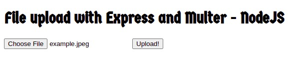

# File Upload with Express and Multer - NodeJS

This is a simple project to get an uploaded file in an HTML form and save it inside a /uploads folder locally. It was made based on one of [Cangaceiro JavaScript](http://cangaceirojavascript.com.br/)'s posts.

## How as it made?

It was made using [Express](https://expressjs.com/) as the server framework, and [Multer](https://www.npmjs.com/package/multer) to handle the actual file uploading.

It is a very simple code, I believe you can understand it just by reading.

## How does it work?

Choose your file, click on **_upload_**, and it'll appear in the `uploads/` folder.

Thanks for reading 'till here, I wish you a wonderful day!